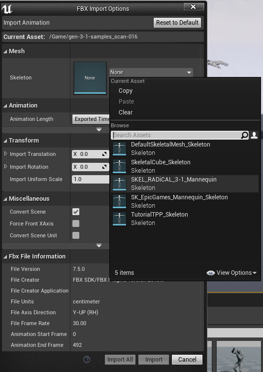
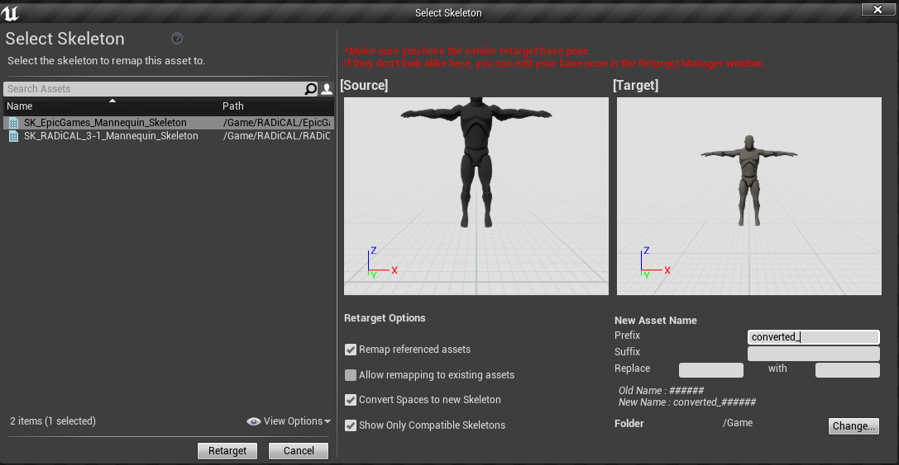

# RADiCAL FBX to Unreal Retargeting Assets

 
This repository provides tools for retargeting the imported RADiCAL 3.1 skeleton animations to the default Epic skeleton. We have set up the Bone Mapping from RADiCAL 3.1 to the Humanoid Rig, as well as a standard T-Pose for the Epic skeleton.

We have included some sample FBX files you can use to test this process.

When importing your RADiCAL animations, select the SKEL_RADiCAL_3-1_Mannequin as follows:

To retarget animations, right-click on an animation (we provided sample RADiCAL-generated animations) and select Retarget Anim Assets -> Duplicate Anim Assets and Retarget. Then select the skeleton to remap to (e.g. UE4 Mannequin Skeleton). The two skeletons should be in the same pose. Then click Retarget. It should look as follows:

If you wish to convert to other skeletons, follow the Retarget Manager documentation at https://docs.unrealengine.com/en-US/Engine/Animation/Persona/BasePoseManager/index.html. We have included T-pose Pose Assets for the RADiCAL 3.1 skeleton and the UE4 Mannequin skeleton. Using the T-pose as a base pose will ensure a consistent result across skeletons.
